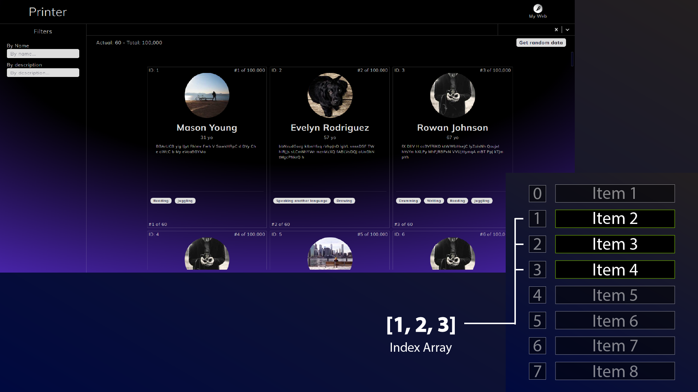

#  Print 10K items into the DOM without killing myself trying

This project demonstrates a technique for efficiently displaying large datasets (>10,000 items) in the DOM using lazy loading and slicing.

### Key Features:

- **Lazy Loading**: Only a limited number of items are initially loaded into the DOM, improving performance and user experience, especially for large datasets.

- **Slicing**: Data is organized into smaller sub-arrays for efficient manipulation and rendering.
Infinite Scrolling: As the user scrolls down, new data chunks are dynamically added to the DOM, creating a seamless user experience for large datasets.

- **Infinite Scrolling**: As the user scrolls down, new data chunks are dynamically added to the DOM, creating a seamless user experience for large datasets.

## Technology Stack:

- **Frontend**: React (with TypeScript)
- **Backend**: Node.js (with Express) and TypeScript

## Project Description:

This project utilizes a two-step approach to handle large datasets:



- **Data Preprocessing**: The initial data, an array of objects with properties like name, id, description, and age, is sliced into an array of sub-arrays. Each sub-array contains a predefined number of objects **(e.g., 20)**.

- **Lazy Loading and DOM Manipulation**: Initially, only the first few sub-arrays (e.g., first two, representing 40 items) are rendered in the DOM. As the user scrolls down, the application detects the scroll position and dynamically adds the next sub-array to the DOM. To maintain a constant number of items displayed, the first sub-array is removed from the DOM simultaneously.

>Benefits:

**Improved Performance**: By loading data in chunks, the initial page load time is significantly reduced, especially for very large datasets.

**Enhanced User Experience**: Users don't have to wait for the entire dataset to load, providing a smoother browsing experience.

**Efficient Memory Usage**: Only the currently displayed data is held in memory, improving overall application performance.

**Type Safety and Maintainability**: TypeScript provides type safety and improves code maintainability throughout the project.

## Runing this code:

```
$ cd backend
$ pnpm i
$ pnpm dev
```

in another terminal:

```
$ cd frontend
$ pnpm i
$ pnpm dev
```

> Thanks for reading 💓
